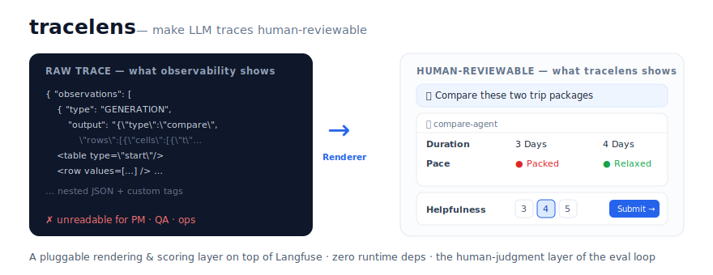

# tracelens

> 让你的 LLM trace 变得人类可评审。一个架在 Langfuse 之上、可插拔的渲染与打分层。

[English](README.md) · **简体中文**



**零运行时依赖 · 跑在 Node ≥ 22.18(原生 TypeScript,免构建)· `typecheck` + 自检在 CI 中运行。**

## 30 秒上手(零安装)

无需 `npm install`、无需构建——只要 Node ≥ 22.18:

```bash
git clone https://github.com/heqiu12345/tracelens.git tracelens && cd tracelens
node apps/review-server/src/server.ts   # → http://localhost:4317 (内置 demo 数据)
# …或一个纯静态、无后端的「前后对比」页:
node demo/build.ts && open demo/index.html
```

## 问题

像 **Langfuse** 这样的可观测性平台能存下你的 agent trace,但只把它们渲染成原始的 observation 树和 JSON。对于复杂 agent(工具链、结构化/自定义输出、多轮会话),以及对于**非工程师评审者**(PM / QA / 运营 / 领域专家)来说,这些根本读不了。*你没法评审你读不懂的东西。*

**tracelens** 就是缺失的最后一公里:一个可插拔层,把任意 trace 变成**人类可读的会话**,让领域专家**按版本化的 rubric 给它打分**,并把这些判断**回流进 loop**。

它**不重造** Langfuse。Langfuse 仍是后端(存储、查询)。tracelens 只负责 Langfuse 永远不会替你做的那部分:**领域渲染 + 人类判断**。

## 为什么 —— AI engineering loop

`trace → 监控 → 构建数据集 → 实验 → 评估 → trace` 这个 loop 正越来越能被 agent 自动化。但正如 Langfuse 博客 [《AI is eating AI engineering》](https://langfuse.com/blog/2026-06-09-ai-is-eating-ai-engineering) 所言,自动化一旦*越过你还能为产出背书的那条线*,交付的就是 **agent slop(AI 糊弄活)**。真正持久的优势是**「你对『什么才算好』的判断力,以及你为传授它所付出的用心」**。

tracelens 是这个 loop 里的**人类判断层**:

- **亲自读 trace** → 做得高效、且非工程师也能读(Renderer)
- **抽样评审 + 校准** → 一套真实的工作流(Rubric + 评审 UI)
- 把判断注回**数据集**与 **judge 校准**(FeedbackSink)

## 架构 —— 框架 + 插件

核心近乎零领域逻辑。所有领域相关的东西都活在 **4 个契约**背后的插件里:

| 契约 | 职责 |
|---|---|
| `DataSource` | 取数 / 写回 trace —— 首个适配器:**Langfuse** |
| `Renderer` | trace → 人类可读的 `ConversationView` *(核心差异化)* |
| `Rubric` | 版本化的打分维度,按 trace 的 tag/version 路由 |
| `FeedbackSink` | 把判断分发到 score / 数据集 / judge 校准 |

Renderer 只产出 **UI 原语**(`text · markdown · table · card · tool-call · image`),绝不产出 HTML —— 因此同一套渲染结果能跨 web / 终端 / 截图复用。

**「可读」在实践中意味着什么:** 内置的默认 renderer 开箱即认常见形态 —— OpenAI 的 `messages`/`choices`、ADK/Gemini 的 `parts`、纯文本 —— **并把 Langfuse 的 observation 树展开成一步步的「agent 过程」视图**:每一次 LLM 调用、工具调用(名称 · 入参 · 结果)、子 agent,都按顺序、按嵌套缩进展示。这就是从*读最终答案*到*复核 agent 是怎么得到答案的*那一跃 —— 也正是原始 observation 树让人头疼的地方。对于**领域协议**(自定义标签、专有工具链),你写一个 ~30 行的 `Renderer`(见 [`examples/custom-tag-chatbot`](examples/custom-tag-chatbot))。在你写之前,app 会给出尽力而为的视图,**并提示你缺一个 renderer** —— 绝不甩给你一堵 JSON 墙。

## 快速开始 —— 接上你的 Langfuse

```bash
export LANGFUSE_HOST=https://cloud.langfuse.com   # 或你自托管的 URL
export LANGFUSE_PUBLIC_KEY=pk-lf-...
export LANGFUSE_SECRET_KEY=sk-lf-...
node packages/adapter-langfuse/smoke.ts           # 列出最近的 trace + 渲染一条
```

```ts
// 目前各 package 仅在 workspace 内部(尚未发布)—— 请从源码路径引入,
// 或自行配置打包。发布到 npm 在 roadmap 上。
import { langfuseDataSourceFromEnv, langfuseDefaultRenderer } from '@tracelens/adapter-langfuse';
import { renderConversationView } from '@tracelens/review-ui';

const ds = langfuseDataSourceFromEnv();                       // 读取 LANGFUSE_* 环境变量
const { items } = await ds.listTraces({ tags: ['prod'] }, { page: 1, limit: 20 });
const view = langfuseDefaultRenderer.render(await ds.getTrace(items[0].id));
const html = renderConversationView(view);                    // → 丢进任意页面
```

零运行时依赖(Langfuse 公共 REST API + Node `fetch`)。筛选条件映射到原生参数(`userId / sessionId / tags / 时间`)+ 用于 metadata 的 `filter` DSL。想要更漂亮的领域视图,就写你自己的 `Renderer`(见 `examples/custom-tag-chatbot`)。

### 或者直接跑评审 app

```bash
node apps/review-server/src/server.ts   # → http://localhost:4317
```

一个完整的浏览器 UI —— 浏览并筛选 trace、阅读渲染后的会话、按 rubric 打分、把判断作为 Langfuse score 写回。**开箱即用内置 demo 数据**(无需配置);设置上面三个 `LANGFUSE_*` 变量即可指向你自己的项目。

## judge 校准 —— 人类分 vs LLM-judge

tracelens 含一层 **judge 校准**:跨 trace 把人类打分和 LLM-judge 打分摆在一起,量化两者有多合拍。聚合校准盘给出**一致率 / Cohen's κ / 混淆矩阵 / 偏置(judge 偏宽松还是偏严)/ 置信度门控** —— 并采用**诚实分母**(只算两边都打了分的 trace,按维度标 `n=`,样本不足的维度灰显),样本超过拉取上限时还会给出截断提示。从 Top 分歧可**下钻到单条 trace 的并排对照** —— 左右对比人类与 judge 各自的分值*与理由* —— 判定 judge 出错时,一键经 `FeedbackSink` 回流,沉淀成 judge-eval 集。

跑 `node apps/review-server/src/server.ts`,打开页面,切到 **Calibration** 标签即见(**内置 demo 数据开箱可用**,无需配置)。如果你的 judge 分名与 rubric 维度对不齐,用 `LANGFUSE_JUDGE_MAP`(JSON,如 `{"test_eva":"default.accuracy"}`)显式映射。

## 现状

🚧 **早期 WIP —— 但这里的每一样都能跑。** 契约已对一个真实的复杂 agent 自验证(`examples/custom-tag-chatbot`:对比表格 + 产品引用 → `ConversationView`),并配有 HTML renderer 的单元测试(含 XSS 转义)、Langfuse 适配器的 mock-fetch 契约测试,以及校准引擎(配对 + 一致率/κ/偏置/门控)及其渲染的纯函数测试。六套自检在 CI 中运行。

```bash
npm install        # 仅 devDeps:typescript + @types/node(运行时仍零依赖)
npm run typecheck  # tsc --noEmit —— 干净
npm run verify     # core 契约 + adapter + review-ui + 校准 自检
npm run demo       # 零后端的前后对比页 → demo/index.html
```

**Roadmap(欢迎 PR):** 按版本路由 rubric · 更多 renderer(LangGraph / CrewAI / OpenAI SDK)· 更顺手的评审工效(键盘流、队列)· 把 package 发布到 npm。**为你自己的 agent 写一个 `Renderer` 是绝佳的第一份贡献。**

## 许可证

MIT © heqiu12345
